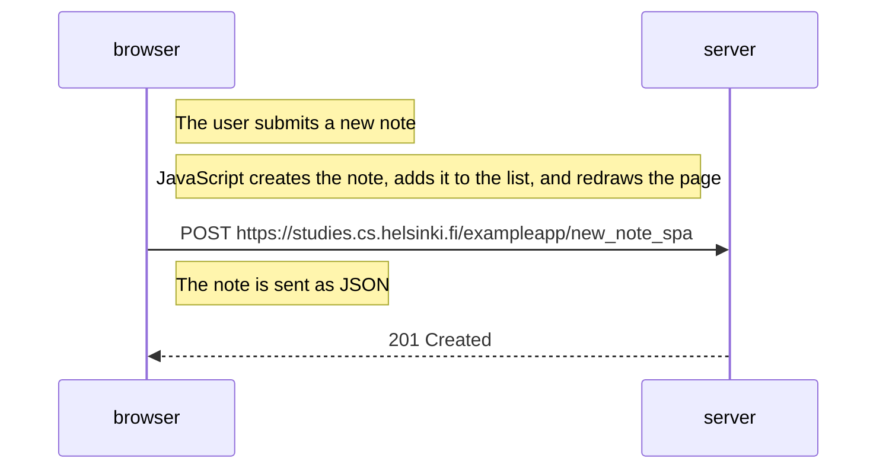

```mermaid
sequenceDiagram
    participant browser
    participant server

    Note right of browser: The user submits a new note
    Note right of browser: JavaScript creates the note, adds it to the list, and redraws the page

    browser->>server: POST https://studies.cs.helsinki.fi/exampleapp/new_note_spa
    Note right of browser: The note is sent as JSON

    server-->>browser: 201 Created
```